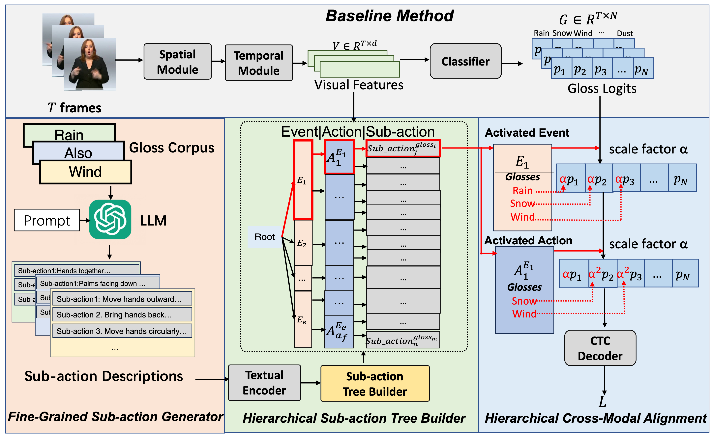

# HST-SLR: Hierarchical Sub-action Tree with Large Language Models for Continuous Sign Language Recognition

This is the official implementation of the paper by Dejie Yang, Zhu Xu, Xinjie Gao and Yang Liu



> Continuous sign language recognition (CSLR) aims to transcribe untrimmed videos into glosses, which are typically textual words. Recent studies indicate that the lack of large datasets and precise annotations has become a bottleneck for CSLR due to insufficient training data. To address this, some works have developed cross-modal solutions to align visual and textual modalities. However, they typically extract textual features from glosses without fully utilizing their knowledge. In this paper, we propose the Hierarchical Sub-action Tree (HST), termed HST-CSLR, to efficiently combine gloss knowledge with visual representation learning. By incorporating gloss-specific knowledge from large language models, our approach leverages textual information more effectively. Specifically, we construct an HST for textual information representation, aligning visual and textual modalities step-by-step and benefiting from the tree structure to reduce computational complexity. Additionally, we impose a contrastive alignment enhancement to bridge the gap between the two modalities. Experiments on four datasets (PHOENIX-2014, PHOENIX-2014T, CSL-Daily, and Sign Language Gesture) demonstrate the effectiveness of our HST-CSLR. 
>
## 1. Prerequisites
1. Create a `Conda` environment.
```bash
conda create -n HST python=3.7 -y && conda activate HST
```
2. Install PyTorch with Conda
```bash
conda install pytorch==1.13.1 torchvision==0.14.1 torchaudio==0.13.1 pytorch-cuda=11.7 -c pytorch -c nvidia
```
You can download PyTorch for your own CUDA version by yourself, but the version is better >=1.13 to be compatible with ctcdecode or these may exist errors.

3. Install ctcdecode
ctcdecode==0.4 [[parlance/ctcdecode]](https://github.com/parlance/ctcdecode)，for beam search decode. (ctcdecode is only supported on the Linux platform.)

4. Install other requirements 
```bash
pip install -r requirements.txt 
```

## 2. Data Preparation
You can choose any one of following datasets to verify the effectiveness of HST-SLR.

### PHOENIX2014 dataset
1. Download the RWTH-PHOENIX-Weather 2014 Dataset [[download link]](https://www-i6.informatik.rwth-aachen.de/~koller/RWTH-PHOENIX/). Our experiments based on phoenix-2014.v3.tar.gz.

2. After finishing dataset download, extract it. It is suggested to make a soft link toward downloaded dataset.   
`ln -s PATH_TO_DATASET/phoenix2014-release ./dataset/phoenix2014`

3. Run the following command to generate gloss dict and resize image sequence.     
```bash
cd ./preprocess
python dataset_preprocess.py --process-image --multiprocessing
```

### PHOENIX2014-T dataset
1. Download the RWTH-PHOENIX-Weather 2014 Dataset [[download link]](https://www-i6.informatik.rwth-aachen.de/~koller/RWTH-PHOENIX-2014-T/)

2. After finishing dataset download, extract it. It is suggested to make a soft link toward downloaded dataset.   
`ln -s PATH_TO_DATASET/PHOENIX-2014-T-release-v3/PHOENIX-2014-T ./dataset/phoenix2014-T`

3. Run the following command to generate gloss dict and resize image sequence.     
```bash
cd ./preprocess
python T_process.py
python dataset_preprocess-T.py --process-image --multiprocessing
```

### CSL-Daily dataset

1. Request the CSL-Daily Dataset from this website [[download link]](http://home.ustc.edu.cn/~zhouh156/dataset/csl-daily/)

2. After finishing dataset download, extract it. It is suggested to make a soft link toward downloaded dataset.   
`ln -s PATH_TO_DATASET ./dataset/CSL-Daily`

3. Run the following command to generate gloss dict and resize image sequence.     
```bash
cd ./preprocess
python dataset_preprocess-CSL-Daily.py --process-image --multiprocessing
```

## 3. Build Hierarchical Sub-action Tree

### 3.1 Generate Sub-action
Choose the dataset from `phoenix2014/phoenix2014T/CSLDaily` and run the folling command to generate descriptions for each word. You should modify the api_key in `description_generate.py`(line 10). If you want to generate the descriptions yourself, please make sure to remove the file `description_{target_dataset}.txt` in the directory first.
```bash
cd ./hst_build/generation
python description_generate.py --dataset target_dataset
```

### 3.2 Build HST
Choose the dataset from `phoenix2014/phoenix2014T/CSLDaily` and run the following command to build HST with the descriptions obtained before.
```bash
cd ./hst_build
python cluster.py --dataset target_dataset
```

### 3.3 Prototype, Update Matrix and Loss Matrix
Choose the dataset from `phoenix2014/phoenix2014T/CSLDaily` and run the following command to set the prototype for each tree node, generate the update matrix for updating and find the tree node that contains a certain word.
```bash
python prototype_set.py --dataset target_dataset
python update_matrix.py --dataset target_dataset
python search_matrix.py --dataset target_dataset
```

We have provided all the generated results mentioned earlier. Please download the zip file through the link [Google Drive](https://drive.google.com/file/d/1z2n-bh2pgR5iCX9tDJpgixMgHGtKDts1/view?usp=drive_link). Then put the file in `./HDT_prototype` and unzip it.

## 4. Testing

### PHOENIX2014 dataset

| Dev WER  | Test WER  | Pretrained model                                             |
| ---------- | ----------- | --- |
| 17.9%      | 18.2%       | [[Google Drive]](https://drive.google.com/file/d/1Jmg5LlxSRZC-3XCYLZY6TvzPYU_Z6t1Q/view?usp=drive_link)|

​To evaluate the pretrained model on PHOENIX2014, run the command below：
```bash
python main.py --config ./configs/baseline_14.yaml --device your_device --work-dir ./work_dir/your_expname/ --load-weights path_to_weight.pt --phase test
```

### PHOENIX2014-T dataset

| Dev WER  | Test WER  | Pretrained model                                             |
| ---------- | ----------- | --- |
| 17.4%      | 19.3%       | [[Google Drive]](https://drive.google.com/file/d/15D-ontHXLNVSUbUzoV01rRMCQGsZjPJ_/view?usp=sharing)|

​To evaluate the pretrained model on PHOENIX2014-T, run the command below：
```bash
python main.py --config ./configs/baseline_14T.yaml --device your_device --work-dir ./work_dir/your_expname/ --load-weights path_to_weight.pt --phase test
```

### CSL-Daily dataset

| Dev WER  | Test WER  | Pretrained model                                            |
| ---------- | ----------- | --- |
| 27.5%      | 27.4%       | [[Google Drive]](https://drive.google.com/file/d/1q_IgHgMEOdrfLhKwqna3LzU6nIDd2YbZ/view?usp=drive_link)|

​To evaluate the pretrained model on CSL-Daily, run the command below：   
```bash
python main.py --config ./configs/baseline_CD.yaml --device your_device --work-dir ./work_dir/your_expname/ --load-weights path_to_weight.pt --phase test
```

## 5. Training

To train the SLR model on PHOENIX2014, run the command below:
```bash
python main.py --config ./configs/baseline_14.yaml --device your_device --work-dir ./work_dir/your_expname/
```

To train the SLR model on PHOENIX2014-T, run the command below:
```bash
python main.py --config ./configs/baseline_14T.yaml --device your_device --work-dir ./work_dir/your_expname/
```

To train the SLR model on CSL-Daily, run the command below:
```bash
python main.py --config ./configs/baseline_CD.yaml --device your_device --work-dir ./work_dir/your_expname/
```

## 6. Sign Language Gesture

We also conduct experiments on the Sign Language Gesture dataset. First, download the dataset through the link [Google Drive](https://drive.google.com/file/d/12a0mQ_kH7Pk4B2ntb0qg_qGN9tfbwnnu/view?usp=drive_link) and the pretrained weights through the link [Google Drive](https://drive.google.com/file/d/1u8IdnniordVVdmDYkIV5qBMmjuViiLGx/view?usp=drive_link). Then put the files in `./SLG` and unzip them. Then run the command below:
```bash
python train.py --device your_device
```

## 7. Citation
```
@inproceedings{gan2024signgraph,
  title={HST-SLR: Hierarchical Sub-action Tree with Large Language Models for Continuous Sign Language Recognition},
  author={Dejie Yang, Zhu Xu, Xinjie Gao and Yang Liu},
  booktitle={IEEE International Conference on Multimedia & Expo(ICME)},
  year={2025}
}
```
